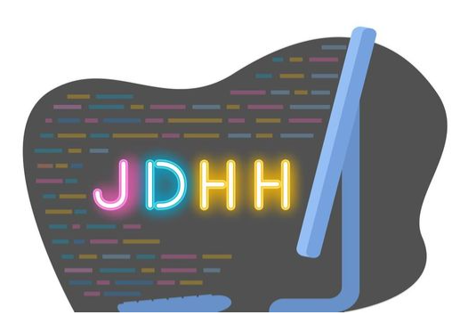

# JDHH <Λλ> Junior Developer Happy Hour

---

# FAQ (Frequently Asked Questions)

---

## What is JDHH about?
JDHH was founded by Steven "Sam" Miyakawa and Braidy Merkle, two Senior Software Engineers who wanted to give back to the Developer Community by forming a group to help people on their journey towards becoming Software Engineer's.

---

## Who is Steven "Sam" Miyakawa?
Steven "Sam" Miyakawa is a Senior Software Engineer at Lyft.

---

## Who is Braidy Merkle?
Braidy Merkle is a Senior Software Engineer at Nordstrom Trunk Club.

---

## How can JDHH help me?
JDHH, once a week invites a Senior Software Engineer and or a Community Content Provider in which Juniors can ask them any questions related to their Journey, Code itself as a subject or Resources that can be used to help advance a Juniors skillsets and knowledge.
In addition to this JDHH offers the rare AMA (Ask Me Anything) Format which allows a Junior the opportunity to ask their Seniors anything.
It is a priceless setting to where a Junior can actually approach an established Senior and learn from their knowledge and experience!

---

## How can I join the JDHH community?
- Great Question! you can join the Meet up group for FREE here [JDHH Group](https://www.meetup.com/Junior-Developer-Happy-Hour/).
And RSVP for future events.
- Subscribe to Braidy's Youtube Channel where all Meet ups are recorded, as well as some awesome additional content here [YouTube](https://www.youtube.com/c/BraidyMerkle/featured).

---

## I missed a JDHH Meet up, Are Meetings Recorded?
Yes! you can find all recorded sessions here on Braidy's [YouTube](https://www.youtube.com/c/BraidyMerkle/featured) Channel.

---

## Where can I submit questions I have for a Meet up, and can I ask ahead of the scheduled Meet up?

Absolutely! we use Sli.do it can be found here [Slido](https://app.sli.do/event/bgtbdflr/live/questions).
- You can ask Anonymously.
- You can ask before a Meet up, and when the Meet Up convenes your question will be answered.
- Feel free to visit the Slido as much as you'd like to jot down questions you have that you may not want to forget!

---

## What are some good coding resources to practice my skills?

- Edabit's Coding Challenge Platform FREE here [Edabit](https://edabit.com/).
- LeetCodes Coding Challenge Platform FREE here [LeetCode](https://leetcode.com/).
- Code War's Coding Challenge Platform FREE here [CodeWars](https://www.codewars.com/).
- HackerRank Coding Challenge Platform FREE here [HackerRank](https://www.hackerrank.com/).
- CodeSignals Coding Challenge Platform FREE here [CodeSignal](https://codesignal.com/).

---

## Can you reccomend any good books to read?

Yes! Check out these solid reads and read them in the following order.
- 1. Eloquent JavaScript Download the PDF here [EloquentJavaScript]().
- 2. Effective JavaScript Download the PDF here [EffectiveJavaScript]().
- 3. Secrets of a JavaScript Ninja Download the PDF here [SecretsOfAJavaScriptNinja]().

Additional Books on Grit, Persaverence, Passion, Mindset and Habits that can aid you on your Journey as a Software Engineer and Human.
- 1. Grit the Power of Passion and Persaverence Download the PDF here [Grit]().
- 2. MindSet the New Psychology of Success Download the PDF here [MindSet]().
- 3. Atomic Habits Download the PDF here [AtomicHabits]().

---

